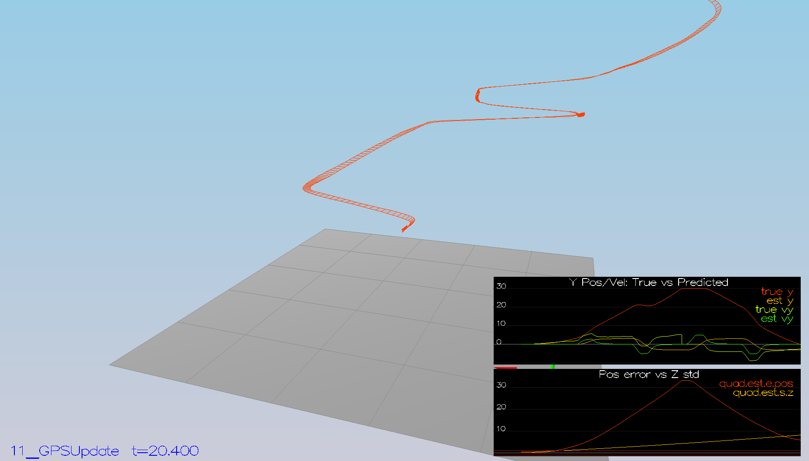

## Project: Estimation

### Writeup / README

#### 1. Provide a Writeup / README that includes all the rubric points and how you addressed each one.  You can submit your writeup as markdown or pdf.  

You're reading it! Below I describe how I addressed each rubric point and where in my code each point is handled.

### Step 1: Sensor Noise

Calculated the standard deviation of the the GPS X signal and the IMU Accelerometer X signal
```
MeasuredStdDev_GPSPosXY = 0.7146
MeasuredStdDev_AccelXY = 0.4898
```


### Step 2: Attitude Estimation

Implemented non-linear complimentary filter
```
  float predictedRollDot, predictedPitchDot, predictedYawDot;

  predictedRollDot = gyro.x + tan(pitchEst)*sin(rollEst)*gyro.y + tan(pitchEst)*cos(rollEst)*gyro.z;
  predictedPitchDot = cos(rollEst)*gyro.y - sin(rollEst) * gyro.z;
  predictedYawDot = (sin(rollEst)/cos(pitchEst))*gyro.y + (cos(rollEst)/cos(pitchEst))*gyro.z;

  float predictedPitch = pitchEst + dtIMU * predictedPitchDot;
  float predictedRoll = rollEst + dtIMU * predictedRollDot;
  ekfState(6) = ekfState(6) + dtIMU * predictedYawDot;	// yaw

  // normalize yaw to -pi .. pi
  if (ekfState(6) > F_PI) ekfState(6) -= 2.f*F_PI;
  if (ekfState(6) < -F_PI) ekfState(6) += 2.f*F_PI;
```


### Step 3: Prediction Step

Implemented prediction step in the PredictState() function

```
  predictedState[0] += predictedState[3]*dt;
  predictedState[1] += predictedState[4]*dt;
  predictedState[2] += predictedState[5]*dt;

  V3F rotated = attitude.Rotate_BtoI(V3F(accel.x*dt,accel.y*dt,accel.z*dt));

  predictedState[3] = predictedState[3] + rotated.x;
  predictedState[4] = predictedState[4] + rotated.y;
  predictedState[5] = predictedState[5] + rotated.z - 9.81f*dt;
  predictedState[6] = curState(6);
```


Calculated the partial derivative of the body-to-global rotation matrix in the function GetRbgPrime()
```
  RbgPrime(0,0) = -cos(pitch)*sin(yaw);
  RbgPrime(0,1) = -sin(roll)*sin(pitch)*sin(yaw) - cos(roll)*cos(yaw);
  RbgPrime(0,2) = -cos(roll)*sin(pitch)*sin(yaw) + sin(roll)*cos(yaw);

  RbgPrime(1,0) = cos(pitch)*cos(yaw);
  RbgPrime(1,1) = sin(roll)*sin(pitch)*cos(yaw) - cos(roll)*sin(yaw);
  RbgPrime(1,2) = cos(roll)*sin(pitch)*cos(yaw) + sin(roll)*sin(yaw);

  RbgPrime(2,0) = 0;
  RbgPrime(2,1) = 0;
  RbgPrime(2,2) = 0;
```

Implemented the rest of the prediction step (predict the state covariance forward) in Predict()
```
  gPrime(0,3) = dt;
  gPrime(1,4) = dt;
  gPrime(2,5) = dt;
  gPrime(3,6) = (RbgPrime(0,0)*accel.x + RbgPrime(0,1)*accel.y + RbgPrime(0,2)*accel.z)*dt;
  gPrime(4,6) = (RbgPrime(1,0)*accel.x + RbgPrime(1,1)*accel.y + RbgPrime(1,2)*accel.z)*dt;
  gPrime(5,6) = (RbgPrime(2,0)*accel.x + RbgPrime(2,1)*accel.y + RbgPrime(2,2)*accel.z)*dt;

  ekfCov = gPrime * ekfCov * gPrime.transpose() + Q;
```

Tuned the QPosXYStd and the QVelXYStd process parameters in QuadEstimatorEKF.txt
```
QPosXYStd = .01
QVelXYStd = .30
```


### Step 4: Magnetometer Update
Implemented magnetometer update in the function UpdateFromMag()
```
  hPrime(0,6) = 1;
  zFromX(0) = ekfState(6);
  float diff = z(0) - zFromX(0);
  // normalize yaw to -pi .. pi
  if (diff > F_PI) z(0) -= 2.f*F_PI;
  if (diff < -F_PI) z(0) += 2.f*F_PI;
```


### Step 5: Closed Loop + GPS Update
Changed to using your estimator by setting Quad.UseIdealEstimator to 0 in config/11_GPSUpdate.txt


Commented out these lines in config/11_GPSUpdate.txt
```
#SimIMU.AccelStd = 0,0,0
#SimIMU.GyroStd = 0,0,0
```
 


Implemented the EKF GPS Update in the function UpdateFromGPS()

```
  hPrime(0,0)=1;
  hPrime(1,1)=1;
  hPrime(2,2)=1;
  hPrime(3,3)=1;
  hPrime(4,4)=1;
  hPrime(5,5)=1;

  zFromX(0) = ekfState(0);
  zFromX(1) = ekfState(1);
  zFromX(2) = ekfState(2);
  zFromX(3) = ekfState(3);
  zFromX(4) = ekfState(4);
  zFromX(5) = ekfState(5);
```


### Step 6: Adding Your Controller
Replaced QuadController.cpp and QuadControlParams.txt with my controller.


